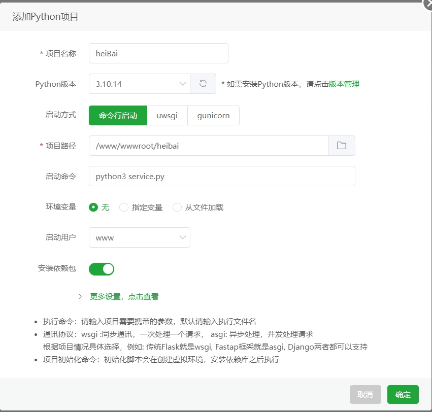
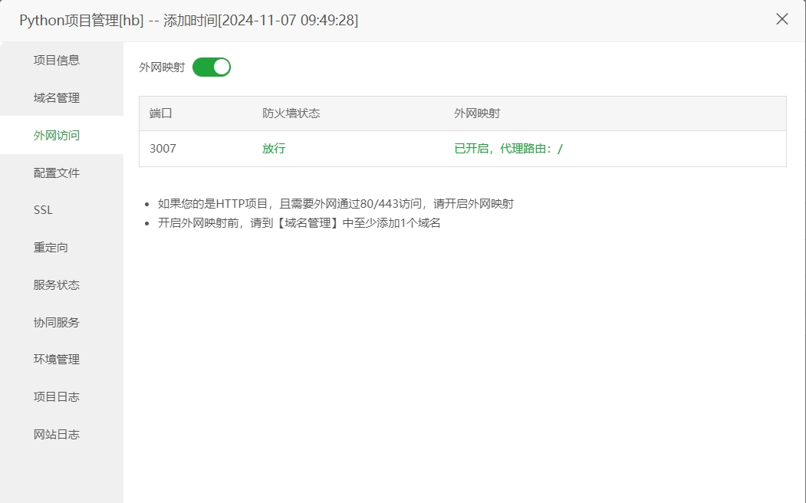

# 证件照黑白图片上色APi端

# 介绍
一款Python版本的黑白图片上色服务
<br>
二次开发源码来自：https://github.com/paperClub-hub/ImageColorizations

<br>
<hr>

# 环境
Python 版本：3.10.14

<br>
<hr>

# 模型
下载：https://pan.baidu.com/s/1VVL9NRi772XF7HCwpso1-Q?pwd=m48d

解压到项目的colorizers文件夹里


# 运行
1.宝塔创建项目



2.需要绑定域名并开启外网映射


<br>
<hr>

# HTTP请求
```text
POST
http://你的域名/colourizeImg

传参：
参数名：base64_image

注：无法通过ip直接请求，所以需要绑定域名     
```
